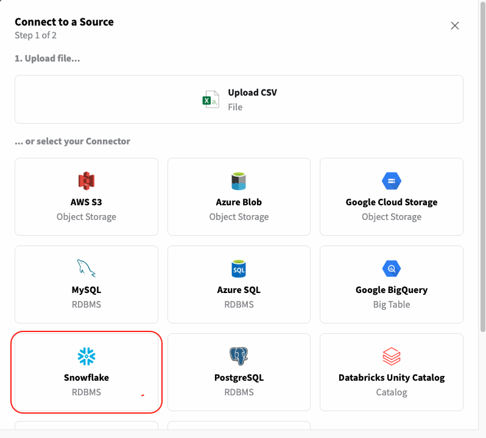

# ❄️ Integrate Fabric with Snowflake - from Analytics to Machine Learning

YData Fabric provides a seamless integration with Snowflake, allowing you to connect, 
query, and manage your data in Snowflake with ease. This section will guide you through the benefits, 
setup, and usage of the Snowflake connector within YData Fabric.

### Benefits of Integration
Integrating YData Fabric with Snowflake offers several key benefits:

- **Scalability:** Snowflake's architecture scales effortlessly with your data needs, while YData Fabric's tools ensure efficient data integration and management.
- **Performance:** Leveraging Snowflake's high performance for data querying and YData Fabric's optimization techniques enhances overall data processing speed.
- **Security:** Snowflake's robust security features, combined with YData Fabric's data governance capabilities, ensure your data remains secure and compliant.
- **Interoperability:** YData Fabric simplifies the process of connecting to Snowflake, allowing you to quickly set up and start using the data without extensive configuration. Benefit from the unique Fabric functionalities like data preparation with Python, synthetic data generation and data profiling.

## Setting Up the Snowflake Connector

:fontawesome-brands-youtube:{ .youtube } <a href="https://youtube.com/clip/UgkxVTrEn2jY8GL-wqSXX3PByuUH5Q81Usih?si=xdpQ4eTCo_SEcvxp"><u>How to create a connector to Snowflake in Fabric?</u></a>

To create a Snowflake connector in YData Fabric Ui you need to meet the following pre-requisites and steps:

!!! note "Prerequisites"
    Before setting up the connector, ensure you have the following:

    - A Snowflake account with appropriate access permissions.
    - YData Fabric installed and running in your environment.
    - Credentials for Snowflake (username, password, account identifier, warehouse, database, schema).

### Step-by-step creation through the UI

To create a connector in YData Fabric, select the *"Connectors"* page from the left side menu, as illustrated in the image below.

{: style="width:75%"}

Now, click in the *"Create Connector"* button and the following menu with the available connectors will be shown. 

{: style="width:50%"}

After selecting the connector type *"Snowflake"* the below menu will be shown. This is where you can configure the connection to your Snowflake instance. For that you will need the following information:

{: style="width:45%; padding-right:10px", align=left}

- **Username:** Your Snowflake username.
- **Password:** Your Snowflake password.
- **Host/Account Identifier:** Your Snowflake account identifier (e.g., xy12345.us-east-1).
- **Port:** The Snowflake port number.
- **Database:** The Snowflake database to connect to.
- **Schema:** The schema within the database.
- **Warehouse:** The Snowflake warehouse to use.
- **Display Name:** A unique name for your connector.
</br></br></br></br></br>

Test your connection and that's it! 🚀

You are now ready to create different **Datasources** using this connector - read the data from a query, evaluate the quality of the data from a table or even
read a full database and generate a synthetic replica of your data!  
Read more about ^^[Fabric Datasources in here](../datasources/index.md)^^.

### Use it inside the Labs

👨‍💻 ^^[Full code example and recipe can be found here](https://github.com/ydataai/academy/blob/master/1%20-%20Data%20Catalog/1.%20Connectors/Snowflake.ipynb)^^.

In case you prefer a Python interface, we also have connectors available through Fabric SDK inside the labs. 
For a seamless integration between the UI and the Labs environment, Fabric offers an SDK that allows you to re-use connectors, datasources and even synthesizers. 

Start by creating your code environment through the Labs. In case you need to get started with the Labs, ^^[check this step-by-step guide](../../get-started/create_lab.md)^^.

```python
    # Importing YData's packages
    from ydata.labs import Connectors
    # Getting a previously created Connector
    connector = Connectors.get(uid='insert-connector-id', 
                               namespace='indert-namespace-id')
    print(connector)
```

#### Navigate your database
Add here a short description

```python title="List available schemas and get the metadata of a given schema"
    # returns a list of schemas
    schemas = connector.list_schemas() 
    
    # get the metadata of a database schema, including columns and relations between tables (PK and FK)
    schema = connector.get_database_schema('PATIENTS')
```

#### Read from a Snowflake instance
Using the Snowflake connector it is possible to:

- Get the data from a Snowflake table
- Get a sample from a Snowflake table
- Get the data from a query to a Snowflake instance
- Get the full data from a selected database

```python title="Read full and a sample from a table"
    # returns the whole data from a given table
    table = connector.get_table('cardio_test')
    print(table)
    
    # Get a sample with n rows from a given table
    table_sample = connector.get_table_sample(table='cardio_test', sample_size=50)
    print(table_sample)
```

```python title="Get the data from a query"
    # returns the whole data from a given table
    query_output = connector.query('SELECT * FROM patients.cardio_test;')
    print(query_output)
```

#### Write to a Snowflake instance
If you need to write your data into a Snowflake instance you can also leverage your Snowflake connector for the following actions:

- Write the data into a table
- Write a new database schema

The **if_exists** parameter allow you to decide whether you want to **append**, **replace** or **fail** in case a table with the same name 
already exists in the schema.

```python title='Writing a dataset to a table in a Snowflake schema'
    connector.write_table(data=tables['cardio_test'], 
                          name='cardio',
                          if_exists='fail')
```

**table_names** allow you to define a new name for the table in the database. If not provided it will be assumed the table names from your dataset.
```python title='Writing a full database to a Snowflake schema'
    connector.write_database(data=database,
                         schema_name='new_cardio', 
                         table_names={'cardio_test': 'cardio'})
```

I hope you enjoyed this quick tutorial on seamlessly integrating Snowflake with your data preparation workflows. ❄️🚀
