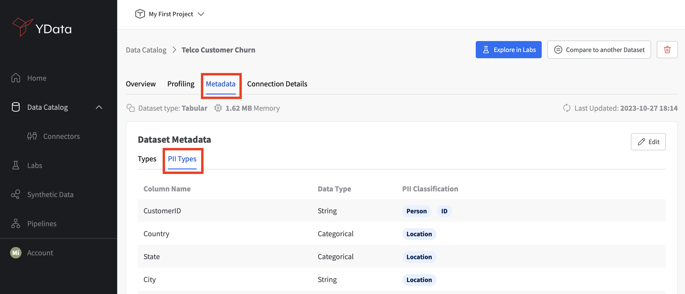

To overcome the concerns around data privacy and enable secure data sharing, Fabric incorporates an **automated Personal Identifiable Information (PII) identification engine** to help detect and handle potential PII.

???+ abstract "What can be considered Personal Identifiable Information (PII)?"
    PII is information that, when used alone or with other relevant data, can uniquely identify an individual. PII may contain **direct indentifiers** (e.g., ID, VAT, Credit Card Number) and/or **quasi-identifiers** (e.g., age, gender, race, occupation). Correctly classifying these is crucial to reduce the risk of re-identification. Learn more about how [Fabric mitigates the risk of re-identification using synthetic data](https://ydata.ai/resources/identity-disclosure-risk-in-a-fully-synthetic-dataset).

Fabric offers a **standardized classification of PII** that automatically highlights and tags potential PII. The automatic detection of PII can be enabled **during the loading process** of your datasets and can be leveraged to generate **privacy-preserving synthetic data**.

<figure markdown>
{: style="height:550px;width:600px"}
</figure>

After the detection, the PII information will be available through the **Metadata > PII Types**, where each column that may represent potential PII is *associated to one or several tags that identify the type of information it might be leaking*.

<figure markdown>
{: style="height:430px;width:1000px"}
</figure>

You can **review the automatic PII classification and add additional PII tags** of your own by editing the metadata and select additional tags available in a **pre-defined list of values**, containing the most common types of potential PII information: email, phone, VAT, zip code, among others.

<figure markdown>
{: style="height:600px;width:1000px"}
</figure>

???+ question "Need a solution to enable data sharing and comply with **GDPR** and **CCPA** regulations?"
    Using ^^[synthetic data](https://ydata.ai/products/synthetic_data)^^ has proven to foster a culture of data-sharing
    within organizations, overcoming the limitations of traditional privacy methods and maximizing data value.
    Try ^^[Fabric Community Version](https://ydata.ai/ydata-fabric-free-trial)^^ to enable secure data sharing.
