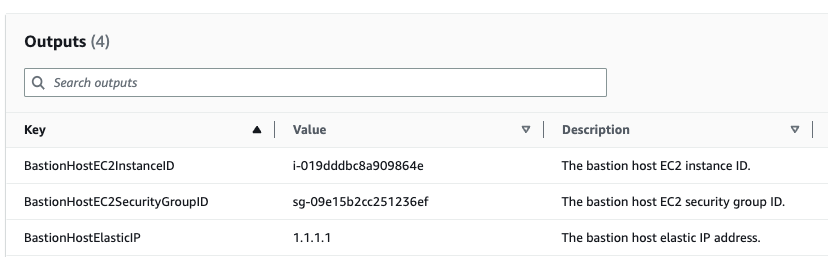

# Bastion host
During the installation, the user will be prompt with the possibility of allowing the creation of a bastion host.
This bastion host is used by YData to give a closer support to the users.
If you allow the creation of this bastion host, an EC2 will be created during installation with NO ingress rules on his security group.

In case is needed, you will need to send the bastion host Elastic IP to YData Fabric and add an ingress rule to the security group as explained below.
In the *CloudFormation* outputs you can find the relevant information of the EC2 bastion host, such as, elastic IP, the EC2 instance ID and the security group ID:

{: style="width:65%"}

## Setting the SG ingress rule
- To give access to the bastion host, please go to the **EC2 service → Security Groups**. 
- You can search for the security group ID provided on the template outputs:

{: style="width:65%"}

- Go to the *"Inbound rules"* tab and click *"Edit"* inbound rules.
- You can then, add an **inbound rule to allow the access** to the bastion host and click *Save* rules, as per the image below.

{: style="width:65%"}

- For single IP source, an IP will be given to you on the support time via email. 
## Removing the SG ingress rule
- As soon the support for the specific case ends, you must **remove the SG ingress rule** and click *Save* rules.

