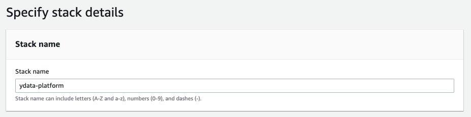
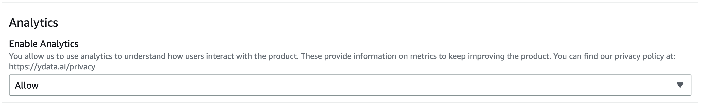
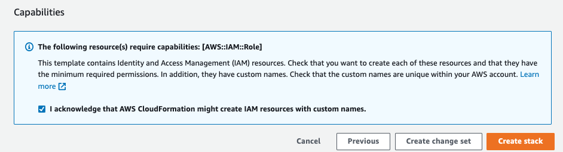
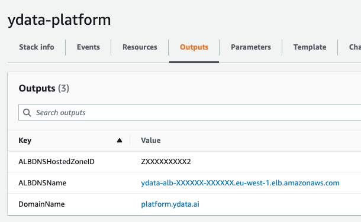

# Deploy

## Installation process
The following procedure explains how to install the platform using the CloudFormation template and how to connect
to the platform after the installation. The full procedure takes around 45m to 1h to be completed.
In order to install the platform in your account, the user must have basic knowledge with the used tools, such as CloudFormation,
Route53 and Cognito.

### 1. Configure the product

!!! Note "Make sure that you comply with the pre-flight checks"

    You can check the ^^[prerequisites and pre-deploy checks](pre_deploy_checklist.md)^^.

Start with the basic configuration for the app installation:

- Ensure you are in the right region.
- Choose the stack name *"ydata-platform"* is the default name
{: style="width:75%"}

#### Network
Define your network configurations to access the platform.
Using the `ACM Certificate ARN` **OR** the `Hosted Zone ID` and the `Domain` chosen from the preflight checklist,
fill up the following parameters:
{: style="width:75%"}

#### OAuth
Define how your users will authenticate in the platform (you can use multiple providers).
{: style="width:55%"}

#### Analytics
You can opt for allowing or not the collection of metrics in order to help us understand how users interact with the product.
No user data is collected at any point.
You can find our privacy policy at ^^[ydata.ai/privacy](https://ydata.ai/privacy)^^.
{: style="width:70%"}

#### Bastion host
A bastion host is created and used to give closer support to the users.
The bastion host is only accessible on user demand, giving us access to EC2 setting an SG ingress rule.
Set it to *"Allow"* to have it available.
More information [here](bastion_host.md).

#### Create

- Check the “**I acknowledge that AWS CloudFormation might create IAM resources with custom names.”**
- Click **Create Stack**

{: style="width:70%"}

### 2. Following the installation process

Now we can follow the step-by-step for the installation of ^^[YData Fabric](https://ydata.ai/products/fabric)^^.

- Click the “Create” button, the installation of the platform will start:

{: style="width:40%"}

The process will take approximately 45-60 minutes.

- If the installation process occurs without any issues, you will see the **CREATE_COMPLETE** status in the stack:

{: style="width:40%"}

- If any error occur during installation, please open a support case at ^^[support.ydata.ai](https://support.ydata.ai)^^.

### 3. Post installation configuration

#### DNS Configuration
If you have your domain registered in Route53, you can check the CF Outputs, and click the domain name to access the
platform:

{: style="width:40%"}

If you are using another DNS provider or a Route53 in another account, you will need to create a CNAME record pointing
to the ALB endpoint (ALBDNSName). As an example:
`CNAME → ydata-alb-xxxxxxxxx.eu-west-1.elb.amazonaws.com`

## 4. Connecting to the platform
To connect the platform, **please allow 20-30m so the platform is completed initialised** and access using the URL
displayed in the CF Outputs.
For the login process, if you choose a customer custom login provider, you need to ensure that the users are created.

Otherwise, you will need to create the users in the Cognito generated by the CloudFormation stack.

More information under can be found at ^^[Login providers](../login_support/login_providers.md)^^.

🚀 Congratulations you are now ready to start exploring your data with **YData Fabric**!
