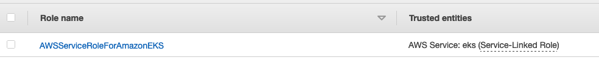
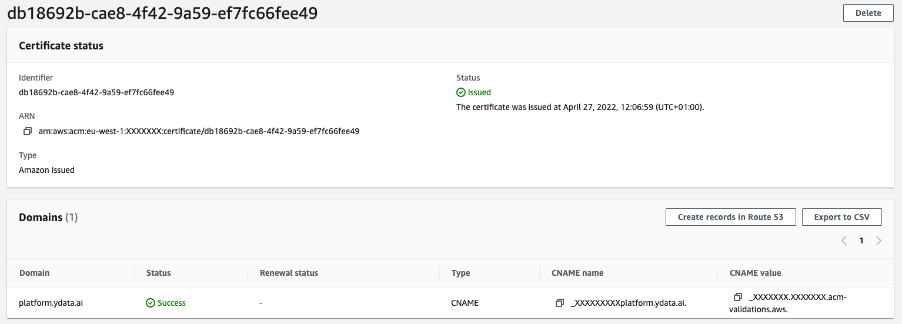
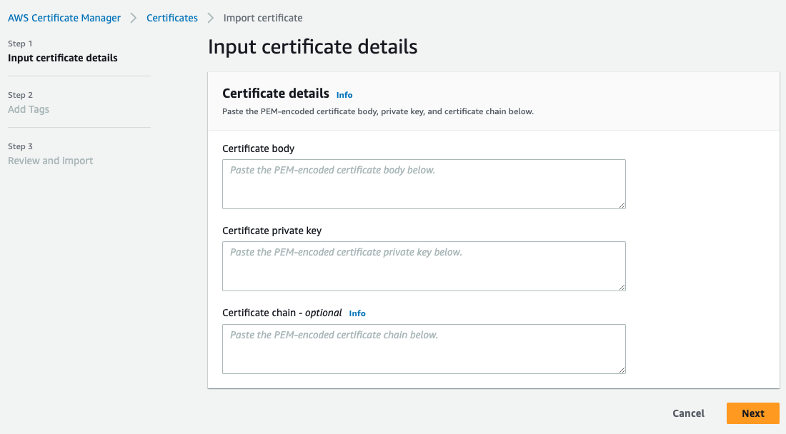
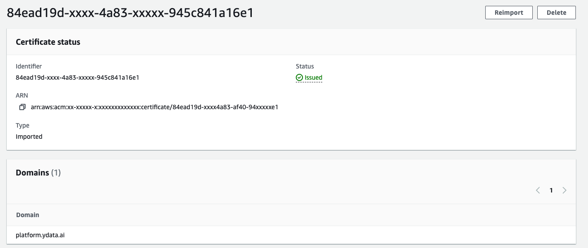
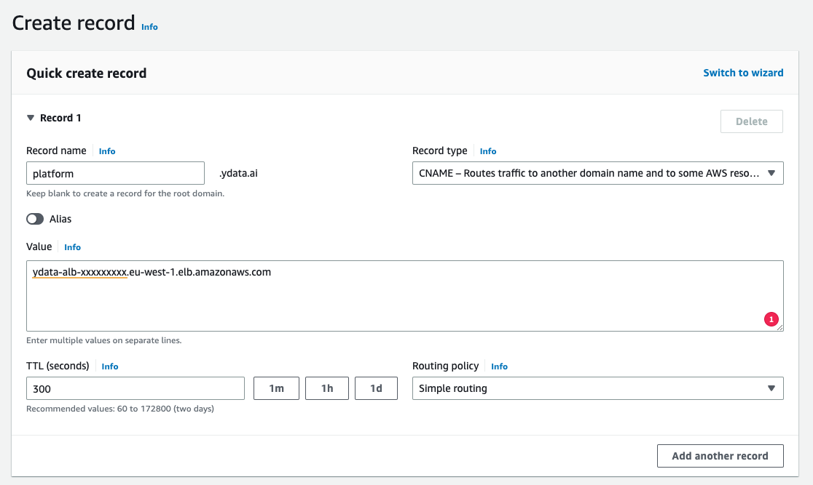

# Checklist and Prerequisites

Deploying [YData Fabric in the AWS cloud](https://aws.amazon.com/marketplace/pp/prodview-hgrqd5lqnqblm?sr=0-1&ref_=beagle&applicationId=AWSMPContessa) offers a scalable and efficient solution for managing and generating synthetic data. AWS provides a robust
infrastructure that ensures high availability, security, and performance, making it an ideal platform for **YData Fabric**.

This cloud deployment allows for rapid scaling of resources to meet varying workloads, ensuring optimal performance and cost-efficiency.

With AWS's comprehensive security features, including data encryption, network firewalls, and identity management,
your synthetic data and models are protected against unauthorized access and threats.
Additionally, AWS's global infrastructure allows for the deployment of YData Fabric in multiple regions,
ensuring low latency and high availability for users worldwide.

!!! Note "Prerequisites"

    If you don't have an AWS account, create a ^^[free account](https://aws.amazon.com/)^^ before you begin.

## Basic Configuration

- **Stack name:** The name of the CloudFormation stack
- **Location**: where to install the platform and create the resources. You can check the available supported regions here:
- **Available regions: ** You can find the [aws regions where YData Fabric is available here](regions.md).

## Permissions

Check and add (if needed) the necessary permissions to the account and region where the platform will be installed.

- Go to Identity and Access Management (IAM)
- Select your user or role used for deployment
- Under the permissions tab, check if you have the following permissions:
    - AdministratorAccess

**this will be updated in the future with only the necessary permissions to create and access the application.*

*You can find [AWS official documentation here](https://docs.aws.amazon.com/iam/).*

## Service Linked Roles
During the deployment all the required Service-Linked Roles are created by AWS by default with the **exception of the EKS
Service-Linked Role**.

Please go to IAM → Roles
Verify that the following Service-Linked role exists in IAM:

- `AWSServiceRoleForAmazonEKS`

Otherwise, please create the missing service linked role:

- Click “Create role”
- Choose AWS service and EKS:

- Click “Next” → “Next”
- Click “Create role”

*You can find ^^[AWS official documentation for service-linked roles](https://docs.aws.amazon.com/IAM/latest/UserGuide/using-service-linked-roles.html).*^^

## Quotas

Check and set (if needed) new quotas for the region where the application will be installed.

- Go to **Service Quotas** (ensure that you are in the right region).
- Select **AWS Services** → **Amazon Elastic Compute Cloud (Amazon EC2)**
- Check for the following quota limits:

| Quota | Minimum | Recommended |
| --- | -- | --- |
| Running On-Demand Standard (A, C, D, H, I, M, R, T, Z) instances | 50¹ | 100² |
| Running On-Demand G and VT instances | 0¹ | 20² |

1. *These limits are the required only for the installation of the platform. Usage is limited.*
2. *Each limit will depend on the platform usage and each client requirements.*

If needed, request for a new limit to the AWS support team. ^^[More on available instance types can be found here](instance_types.md)^^.

## Network configuration

Choose how you want to connect to the platform.

The parameters below will be used during the deployment process.

### DNS Configuration:

In AWS, you will connect the platform providing your own DNS custom domain, for example: `platform.ydata.ai`.
For that, a registered domain is necessary.

### **Domain Name** and **Route53 Hosted Zone ID**

If you have your domain registered in Route53, you can pass the **Route53 Hosted Zone ID** and the **Domain Name**,
and the CloudFormation template will create an ACM certificate and a Route53 record pointing to the ALB used to connect the
platform. So no steps are required before or after the installation.

### **Domain Name** and ACM Certificate ARN

Otherwise, if you have your domain registered in another provider or in a route53 in another account, you will need to do one
of the following steps:

=== "**Create the certificate on ACM and validate it**"

| Request public certificate                                                                               | Certificate granted                                                                                    |
|----------------------------------------------------------------------------------------------------------|--------------------------------------------------------------------------------------------------------|
| {: style="width:90%"} | {: style="width:90%"} |

After the certificate is requested, copy the CNAME value and name, and create the record in your DNS
provider so the certificate can be validated.

=== "**Import the certificate to ACM**"

| Request public certificate                                                              | Certificate granted                                                                                    |
|-----------------------------------------------------------------------------------------|--------------------------------------------------------------------------------------------------------|
| {: style="width:90%"} | {: style="width:90%"} |

After the certificate is imported, ensure the certificate is validated.

After the installation, you will need to create another CNAME record pointing to the ALB endpoint, available in the CF Outputs.

For example:
`CNAME → ydata-alb-xxxxxxxxx.eu-west-1.elb.amazonaws.com`
{: style="width:70%"}

## Login Provider
In AWS you can use multiple providers to connect to the platform.
During the parameter section you can choose to create a Cognito or to use one on your own:
{: style="width:90%"}

Setting this to *True*, **unless you want to use a custom one**, you don’t need to specify any other parameters under the
*OAuth Configuration*.

???- Warning "You can only have one Cognito"

    You can only choose one Cognito:

    - The created during the platform installation.
    - One created by you, where you need to pass the credentials parameters.

    If both are set, the provided parameters will be ignored and the one created during installation will be used.

???- Warning "Some regions do not support Cognito"

    This is not currently supported for some regions!
    For this regions you will need to use the region specific template and pass your own custom oauth configuration!

    Check ^^[regions information here](regions.md)^^.

You can log in to our app currently using the following providers - at **least one is required**, but you can choose multiple ones:

- Google
- Microsoft
- Cognito (you own or the default created during installation)
- GitHub

More detailed ^^[instructions for each login provider can be found here](../login_support/login_providers.md)^^.
If you required another authentication method, please fill up a support case at ^^[support.ydata.ai](https://support.ydata.ai/)^^

After configuring your login provider, please save the values. This values will be used during the deployment process.

As soon as the above steps are all completed, you are ^^[ready to start the deployment](deploy.md)^^.
