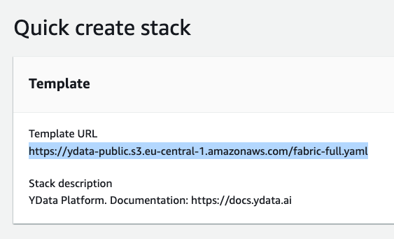
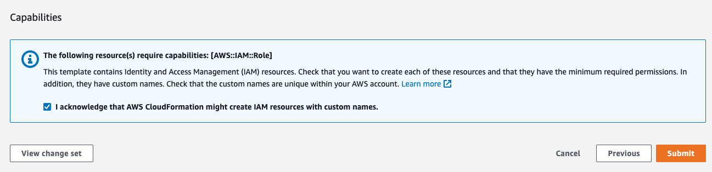

# Update Fabric

**YData** is committed to providing our users with cutting-edge tools and features to enhance their data management and synthetic data generation capabilities.
Our solution updates policy is designed to ensure that YData Fabric remains at the forefront of technological advancements while maintaining the highest standards
of reliability, security, and user satisfaction.

**Key Aspects of Our Update Policy**

- **Regular Updates:** We release regular updates that include new features, performance improvements, and bug fixes. These updates are aimed at enhancing
the overall functionality and user experience of YData Fabric.
- **User Feedback Integration:** We actively seek and incorporate feedback from our user community. This ensures that our updates address real-world challenges
and meet the evolving needs of our users.
- **Seamless Deployment:** Updates are designed to be deployed seamlessly with minimal disruption to ongoing operations.
Our team provides detailed documentation and support to facilitate smooth transitions.
- **Security Enhancements:** We prioritize the security of our platform. Each update undergoes rigorous testing to ensure that it enhances the security
posture of YData Fabric without introducing vulnerabilities.
- **Compatibility and Compliance:** Updates are developed to ensure compatibility with existing systems and compliance with industry standards and regulations,
safeguarding the integrity and continuity of user operations.

By adhering to this policy, **YData** ensures that users consistently benefit from the latest advancements in data technology, reinforcing our commitment
to innovation and excellence in the field of data science and synthetic data generation.

All updates to Fabric are user/organization triggered and by following the next steps to update your **CloudFormation stack**.

## 1. Get the most recent version

- Go to the ^^[**AWS Marketplace Subscriptions](https://console.aws.amazon.com/marketplace/home?region=eu-west-1)^^** → Manage subscriptions
- Click the **YData Fabric** subscription

{: style="width:40%"}

- Click Launch more software.

{: style="width:50%"}

- Check for new versions and click **Continue to Launch**. At this stage you will find the link for the new version.

{: style="width:60%"}

Click the deployment template associated with your installation.

- Here you will have the new template URL. Copy the link as per the image below:

{: style="width:45%"}

- Go to the deployed *CloudFormation stack* and clink in *"Update"* button.
- Choose *“Replace current template”* and provide the new stack URL.

{: style="width:45%"}

- For the parameters, use the same parameters or change if needed. Click **Next → Next → Submit**

{: style="width:75%"}

2. Following the installation process

Now you can follow the ^^[installation process](deploy.md)^^.
Different from the initial deploy, the update process will only take approximately *15-60 minutes* depending on the update complexity.

🚀 Congratulations you have now the latest version of **YData Fabric**!
