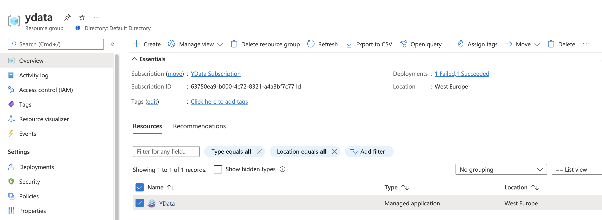
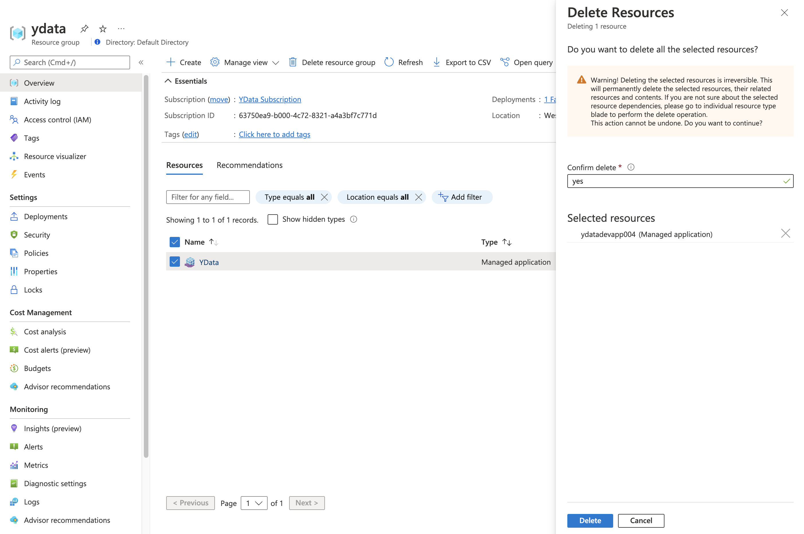

# Clean

The following procedure explains how to delete the platform. The full procedure takes around 45m to 1h to be completed.
To clean up **YData Fabric**, you will need to delete the managed app.

Please take in consideration that this will delete **everything associated with the installation**.

- Start by opening the resource group where the managed app is installed, select the **Managed Application** and click *"Delete"*.

{: style="width:75%"}
{: style="width:75%"}

This will delete the managed app and the managed resource group where all the components are installed.
