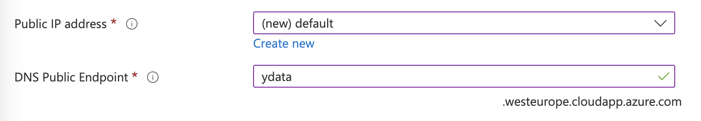
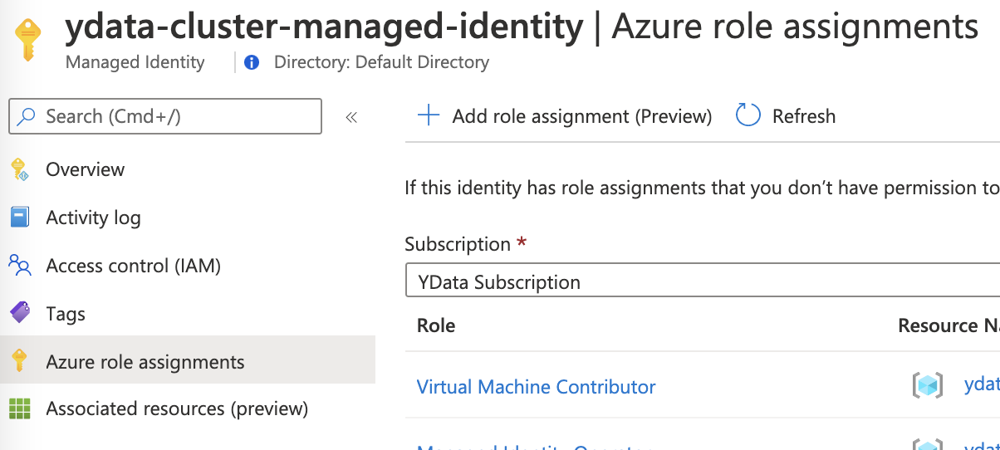
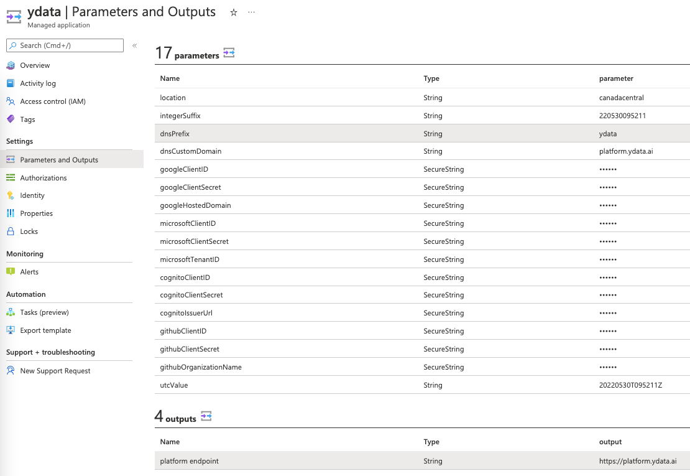

# Deploy

## Installation process

!!! note "Ensure that you have completed the pre-deploy checklist"

    Validate if you have checked all the ^^[deploy requirements](deploy.md)^^ before moving forward with the deploy.

## Basic configuration

- Start by defining the basic configuration for the app installation.

#### JIT Access
{: style="width:40%"}

- Enable the Just in Time (JIT) access for the app installation as shown in the image below. You can see ^^[more about JIT access in the pre-deploy checklist](pre_deploy_checklist.md)^^.

#### Network configuration
- Define your network configuration to access *YData Fabric*.

{: style="width:55%"}

=== "New Public IP"

    - If you choose a new Public IP, you can choose the name or leave it as *(new) default*, but the remaining properties are ignored since the SKU standard
    and assignment static is the recommended by Azure.

    {: style="width:30%"}

    - After that, choose a DNS label for the domain as shown below.

    {: style="width:55%"}

=== "Existing Public IP"

    - If you opt for an existing Public IP, you can choose that IP from the dropdown. The DNS Public Endpoint is automatically filled since this is configured on the IP Address level.
    If your IP is  disabled, please ensure you have the DNS name label defined and the IP is not allocated to any other resource.

    {: style="width:55%"}
    {: style="width:55%"}

    For the DNS Custom Domain, you can use a custom domain, such as, for example platform.ydata.ai.
    After the installation process you will need to create a CNAME or an A record in your DNS provider. More information in the *Post installation step*.

#### OAuth
- Define how you will authenticate to the app after the deployment is completed.

{: style="width:55%"}

#### Analytics
- You can opt for allowing or not the collection of metrics in order to help us understand how users interact with the product. No user data is collected at any point.
Read more about ^^[YData privacy policy](https://ydata.ai/privacy)^^.

#### Create
- Click *“Next”*. Check the provided parameters.
- Insert the contact information
- Read and accept the terms and conditions. Finally click in *"Create"*.

{: style="width:40%"}

## Following the installation process
- After click the “Create” button, the installation of the managed app will start, as shown in the image below.

{: style="width:75%"}

The process will take approximately 45-60 minutes.

- If any error occur during installation, please open a support case at ^^[support.ydata.ai](https://support.ydata.ai)^^.

## Post installation configuration

### IP configuration
If you choose to use **one existing IP** for the platform, you will need to create a role assignment to the resource group where the IP is located.
To do this, open your managed resource group (where the resources are created) and open the `ydata-cluster-managed-identity` Managed Identity.

- Click “**Azure Role Assignments**”

{: style="width:55%"}

- Click “Add role assignment” as shown in the image below.

{: style="width:60%"}

- Choose the Scope *“Resource group”*.
- Choose the subscription where the resource group is located.
- Select the resource group where the IP is located.
- Add the role *“Network Contributor”* and *"Save"*.

### DNS Configuration
If you opt for the **DNS Custom Domain**, you will need to create a CNAME record pointing to the DNS Public Endpoint or an A record pointing to the IP.
Example in Route53:

{: style="width:65%"}
{: style="width:65%"}

## Connecting to YData Fabric

You can get the full URL in the **Managed APP → “Parameters and Outputs” tab → Outputs**

{: style="width:75%"}
{: style="width:75%"}

🚀 Congratulations you are now ready to start exploring your data with **YData Fabric**!
