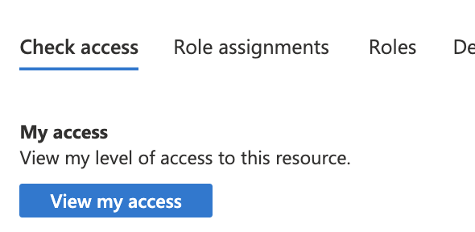
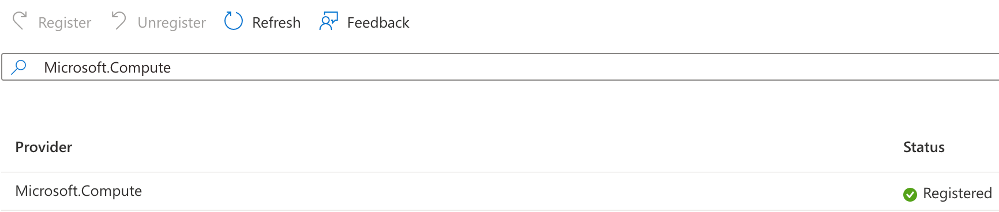
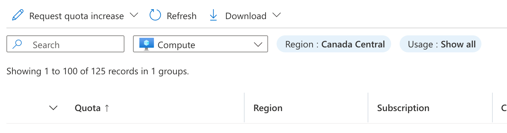
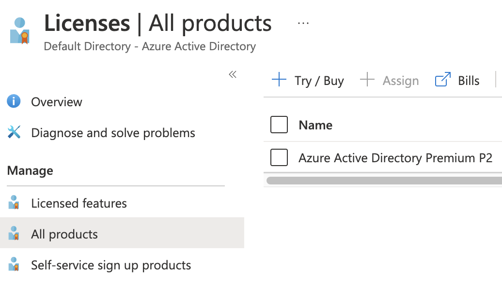

# Checklist and Prerequisites

Deploying [YData Fabric in the Microsoft Azure](https://azuremarketplace.microsoft.com/en-us/marketplace/apps/ydatalda1622051287515.ydata1?tab=overview) offers a scalable and efficient solution for managing and generating synthetic data. AWS provides a robust
infrastructure that ensures high availability, security, and performance, making it an ideal platform for **YData Fabric**.

This cloud deployment allows for rapid scaling of resources to meet varying workloads, ensuring optimal performance and cost-efficiency.

With Microsoft's comprehensive security features, including data encryption, network firewalls, and identity management,
your synthetic data and models are protected against unauthorized access and threats.
Additionally, Azure's global infrastructure allows for the deployment of YData Fabric in multiple regions,
ensuring low latency and high availability for users worldwide.

!!! Note "Prerequisites"

    If you don't have an Azure account, create a ^^[free account](https://azure.microsoft.com/en-us/free/)^^ before you begin.

## Basic Configuration

- **Subscription**: where the platform will be installed
- **Resource group**: where the managed app will be installed:
    - A new one is recommended and can be created automatically during the deployment.

- **Location**: where to install the Managed APP and create the resource groups. The available location for now are:
    - West Europe - Netherlands [westeurope]
    - West US - California [westus]
    - West US - Washington [westus2]
    - Canada Central [canadacentral]
    - Sweden Central [swedencentral]*

    If you need another region, please fill up a support case at ^^[support.ydata.ai](http://support.ydata.ai)^^.

    **Regions without available GPU’s machine types at the time*

- **Application Name**: the Managed APP name
- **Managed Resource Group**: the resource group created by the Managed APP and where all the infrastructure services will be created
(this is created automatically).

## Permissions
Check and add (if needed) the necessary permissions to the subscription where the platform will be installed.

- Go to **Subscriptions**.
- Select the subscription where *YData Fabric* will be installed.
- Click *“View my access”* as shown in the image below.

{: style="width:35%"}

- Check if you have at least the following configurations:


  - Contributor
  {: style="width:70%"}

  And the following **permissions**:

  - Microsoft.Authorization/roleAssignments/read

  - Microsoft.Authorization/roleAssignments/write

  {: style="width:30%"}

- If not, please create a custom role with this two permissions and create the role assignment to the user in the subscription.

For more information check Azure's official documentation on ^^[Azure custom roles](https://learn.microsoft.com/en-us/azure/role-based-access-control/custom-roles)^^
and [Azure built-in roles](https://learn.microsoft.com/en-us/azure/role-based-access-control/built-in-roles#contributor).

## Resource Providers
Check and activate (if needed) resource providers for the subscription where the YData platform will be installed following the next steps.

- Go to **Subscriptions**
- Select the subscription where *YData Fabric* will be installed
- Go to Resource Providers
- Using the filter, check if you have the following resource providers registered. If not, please click the resource provider and click *“Register”*.

    - **Microsoft.Compute**
    - **Microsoft.ContainerInstance**

    {: style="width:75%"}
    {: style="width:75%"}

For more information check ^^[Azure's official documentation on resource providers](https://learn.microsoft.com/en-us/azure/azure-resource-manager/management/resource-providers-and-types)^^
and ^^[Azure Resource Manager](https://learn.microsoft.com/en-us/azure/azure-resource-manager/management/azure-services-resource-providers)^^.

## Register features
Check and register (if needed) the required features.
- Install and update the **aks-preview extension**:

``` shell
    az extension add --name aks-preview
    az extension update --name aks-preview
```

- Register the **'EnableWorkloadIdentityPreview'** feature flag

``` shell
    az feature register --namespace "Microsoft.ContainerService" --name "EnableWorkloadIdentityPreview"
```

- Wait until feature to be registered:

``` shell
    az feature show --namespace "Microsoft.ContainerService" --name "EnableWorkloadIdentityPreview"
```
``` json
    {
        "id": "/subscriptions/xxxxx/providers/Microsoft.Features/providers/Microsoft.ContainerService/features/EnableWorkloadIdentityPreview",
        "name": "Microsoft.ContainerService/EnableWorkloadIdentityPreview",
        "properties": {
            "state": "Registered"
        },
        "type": "Microsoft.Features/providers/features"
    }
```

- After the feature status is “Registered”, refresh the registration of the container service resource provider:

``` shell
    az provider register --namespace Microsoft.ContainerService
```

Read more in Azure's official documentation on ^^[Azure Kubernetes Services (AKS)](https://learn.microsoft.com/en-us/azure/aks/workload-identity-deploy-cluster#install-the-aks-preview-azure-cli-extension)^^.

## Resource compute quotas
Check and set (if needed) new quotas for the region where the managed app will be installed.

- Go to **Subscriptions**.
- Select the subscription where *YData Fabric* will be installed
- Click _“Usage + quotas”_
- Filter by the region where _YData Fabric_ will be installed

{: style="width:60%"}

- Check for the following quota limits:

| Quota | Minimum | Recommended |
| --- | --- | --- |
| Total Regional vCPUs | 16* | 100** |
| Standard DSv3 Family vCPUs | 16* | 100** |
| Standard NCSv3 Family vCPUs*** | 6* | 20** |
| Standard DDSv4 Family vCPUs | 10 | 10 |

*These limits are the required only for the installation of the platform. Usage is limited.

** *Each limit will depend on the platform usage and each client requirements.*

*** Not available in Sweden region

- If needed, request for a new limit to the azure support team as per the image below.

{: style="width:60%"}

Check ^^[Azure's official documentation on quotas](https://learn.microsoft.com/en-us/azure/quotas/view-quotas)^^,
^^[increase regional vCPU quotas](https://learn.microsoft.com/en-us/azure/quotas/regional-quota-requests)^^ and
^^[increase VM-family quotas](https://learn.microsoft.com/en-us/azure/quotas/per-vm-quota-requests)^^.

^^[More on available instance types can be found here](instance_types.md)^^.

## JIT Access
The JIT Access feature will prevent YData Fabric from having write access to the managed app at any time.

- To use the just-in-time access, you must have an ^^[Azure Active Directory P2 license](https://docs.microsoft.com/en-us/azure/active-directory/privileged-identity-management/subscription-requirements)^^.
- Without this license and with the JIT enable, YData will not be able to give any closer support or make updates to the solution.

To check your current license, go to the **Azure Portal → Azure Active Directory → Licenses** and check your license.
To activate the P2 license, click the **“Try/Buy”** button.

{: style="width:50%"}

For more information check Azure's official documentation on ^^[assigning and removing licenses to Azure Active directory](https://learn.microsoft.com/en-us/entra/fundamentals/license-users-groups)^^.
^^[To learn how to enable JIT access and approve requests](https://learn.microsoft.com/en-us/azure/azure-resource-manager/managed-applications/approve-just-in-time-access)^^.

After accepting the request, the YData team will have access in order to make updates and give you closer support.
Any other requests open a support case at ^^[support.ydata.ai](https://support.ydata.ai)^^.
