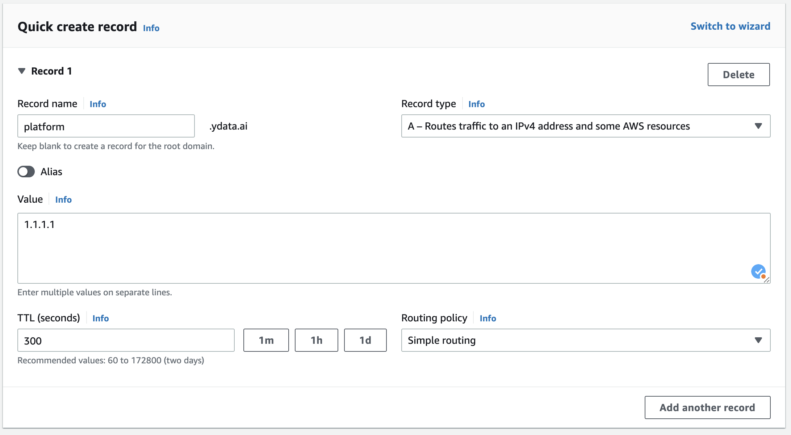

# Deploy

## Installation process
The following information needs to be passed to YData team:

- The SA JSON file generated in the preflight-checklist.
- Project ID
- Region
- DNS Cloud Zone name
- Domain name - the domain that will be used to connect to the platform
- Login provider credentials (ex on google: Client ID, Client Secret, Domain)

## Wait for the installation to be done
YData team will take care of the deployment for you. As soon as it is finished the team will let you know. 

## Post installation configuration

A DNS configuration is needed. For that, if you opt for the IP, you will need to create a record pointing to the Load Balancer IP,
as shown in the image below. 
{: style="width:35%"}

## Connecting to YData Fabric

YData team will share with you the link/URL that you can now use to access YData Fabric.

🚀 Congratulations you are now ready to start exploring your data with **YData Fabric**!

