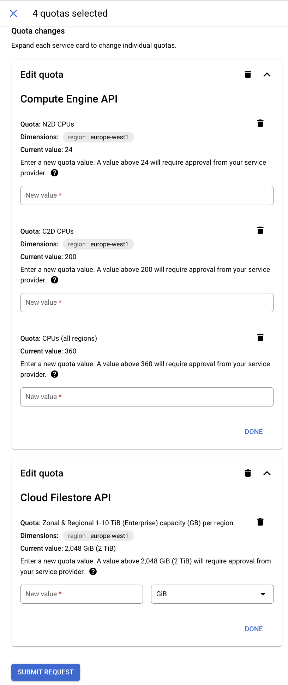

# Checklist and Prerequisites

The deployment will be executed using terraform, and it is fully automated.
It is triggered by YData’s team and the progress can be monitored on the client side.

As a pre-condition, the client must create a service account and share it with YData’s team.
The required permissions will be shared in this document.

The bastion host will be used to provide technical support to the team in case of issues and troubleshooting with the usage
of the platform, and this access will only be used for this purpose.

!!! Note "Prerequisites"

    If you don't have an GCP subscription, create a ^^[free account](https://console.cloud.google.com/welcome?project=ydatasynthetic)^^ before you begin.

### Observations & prerequisites

- The deployment will create one public and private key to establish the connection to the bastion host.
- With this deployment, a security group allowing YData’s IP to establish the connection to the bastion host
via SSH will be created. This should be deleted after the deployment and added in case it is needed.
- The Bastion host can be stopped after the deployment to prevent any charges and created/started to give support.
- The private subnets will have a NAT Gateway attached – this is needed since the GKE needs access to the public internet
to connect the Data Sources and to pull images from the public registries.

## Basic Configuration

- **Project**: where the platform will be installed.
- **Location**: where to install the YData fabric inside the project.

## Enable API's

- Please check if the following API’s for the chosen project are enabled:
    - ^^[API Keys API](https://console.cloud.google.com/apis/library/apikeys.googleapis.com)^^
    - ^^[Artifact Registry API](https://console.cloud.google.com/apis/library/artifactregistry.googleapis.com)^^
    - ^^[Certificate Manager API](https://console.cloud.google.com/apis/library/certificatemanager.googleapis.com)^^
    - ^^[Cloud Resource Manager API](https://console.cloud.google.com/apis/library/cloudresourcemanager.googleapis.com)^^
    - ^^[Cloud Key Management Service (KMS) API](https://console.cloud.google.com/apis/library/cloudkms.googleapis.com)^^
    - ^^[Compute Engine API](https://console.cloud.google.com/apis/library/compute.googleapis.com)^^
    - ^^[Kubernetes Engine API](https://console.cloud.google.com/apis/library/container.googleapis.com)^^
    - ^^[Cloud DNS API](https://console.cloud.google.com/apis/library/dns.googleapis.com?project=ydata-410315)
    - ^^[Cloud Filestore API](https://console.cloud.google.com/apis/library/file.googleapis.com)^^
    - ^^[Cloud Run API](https://console.cloud.google.com/apis/library/run.googleapis.com)^^
    - ^^[Identity and Access Management (IAM) API](https://console.cloud.google.com/apis/library/iam.googleapis.com)^^
    - ^^[Services Networking API](https://console.cloud.google.com/apis/library/servicenetworking.googleapis.com)^^
    - ^^[Cloud SQL Admin API](https://console.cloud.google.com/apis/library/sqladmin.googleapis.com)^^
    - ^^[Cloud Storage](https://console.cloud.google.com/apis/library/storage-component.googleapis.com)^^
    - ^^[Serverless VPC Access API](https://console.cloud.google.com/apis/library/vpcaccess.googleapis.com)^^
    - ^^[Secret Manager API](https://console.cloud.google.com/apis/library/secretmanager.googleapis.com)^^
    - ^^[Cloud Scheduler API](https://console.cloud.google.com/apis/library/cloudscheduler.googleapis.com)^^
    - ^^[Service Usage API](https://console.developers.google.com/apis/api/serviceusage.googleapis.com)^^

## Permissions

The following service account should be created and transferred to YData so the deployment can be triggered.
It is recommended (but not required) that you create a new project for the YData platform. This will make it easier to control
costs and to ensure that YData only have access to their resources.
You can create the service account using the provided commands using the gcloud cli (recommended) or create the service manually
using the google cloud UI.

### GCloud CLI

The following commands will create a new service account with the required permissions to complete the deployment.
The generated JSON file must be sent to YData.

1. Download the following file: https://raw.githubusercontent.com/ydataai/gcp-deploy-permissions/main/clients_custom_role.yaml
2. Create the new SA for the deployment

``` shell
    export PROJECT_ID=
    export SERVICE_ACCOUNT_NAME=

    gcloud config set project $PROJECT_ID
```

- Create a new SA

```shell
    gcloud iam service-accounts create $SERVICE_ACCOUNT_NAME --display-name "GCP Service Account for the Ydata platform"
```

- Get the new key file for the created SA

```shell
    export SA_EMAIL=$(gcloud iam service-accounts list --filter $SERVICE_ACCOUNT_NAME --format 'value(email)')

    gcloud iam service-accounts keys create gcp-ydata-platform-service-account.json --iam-account $SA_EMAIL
```

- Create a new role and associate this role to the new SA

```shell
    gcloud iam roles create ydata_platform_gcp_iam_role --project $PROJECT_ID --file clients_custom_role.yaml

    gcloud projects add-iam-policy-binding $PROJECT_ID --member "serviceAccount:$SA_EMAIL" --role "projects/$PROJECT_ID/roles/ydata_platform_gcp_iam_role"
```

- Activate the new SA locally

  ```shell
      gcloud auth activate-service-account --project=$PROJECT_ID --key-file=gcp-ydata-platform-service-account.json
  ```

- Test the new SA by setting the new account

  ```shell
      gcloud config set account $SA_EMAIL
      gcloud config set project $PROJECT_ID
  ```

- Check if you are logged in with the new SA:

  ```shell
      gcloud auth list
  ```

- Try a command.

```shell
    gcloud container clusters list
```

### GCP Console

Go to IAM -> Service Accounts -> Create Service Account
Choose a name for the service account and click *“Create and Continue”*.
For the Roles add the following ones (you can search by these terms and select the resulting role):

- `roles/container.admin`
- `roles/compute.admin`
- `roles/iam.serviceAccountAdmin`
- `roles/dns.admin`
- `roles/iam.roleAdmin`
- `roles/resourcemanager.projectIamAdmin`
- `roles/cloudsql.admin`
- `roles/servicenetworking.networksAdmin`
- `roles/iam.serviceAccountKeyAdmin`
- `roles/serviceusage.serviceUsageAdmin`
- `roles/file.editor`
- `roles/storage.admin`
- `roles/cloudkms.admin`
- `roles/serviceusage.apiKeysAdmin`
- `roles/artifactregistry.admin`
- `roles/secretmanager.admin`
- `roles/vpcaccess.admin`
- `roles/run.admin`
- `roles/deploymentmanager.editor`
- `roles/cloudscheduler.admin`

After it finished, click Continue and Done.
Open the service account and create a new JSON key:
The transferred key will be used by YData.

## Resource Compute Quotas

Check and set (if needed) new quotas for the region where Fabric will be installed.

- Go to IAM & Admin
- Click “Quotas & System Limits” on the left
- Filter by your region and check for the following quotas

| Quota | Recommended |  |
| --- | --- | --- |
| CPUs (all regions) | >200** |  |
| C2D CPUs | 200** |  |
| N2D CPUs | 24** |  |
| Zonal & Regional 1-10 TiB (Enterprise) capacity (GB) per region | 1024GiB |  |
***Each limit will depend on the platform usage and each client requirements.*

- If needed, request for a new limit to the Google's support team:

{: style="width:35%"}

## Network configuration

Choose how you want to connect to the platform.

In GCP, it’s possible to connect to YData Fabric using your own DNS custom domain, for example: ydatafabric.yourdomain.com.
(It’s necessary to have a domain registered).

### Domain Name and GCP Cloud DNS Zone
If you have your domain registered in GCP Cloud DNS, you can use the Zone Name and the Domain Name, and the Deployment will
create a Managed Certificate and the Cloud DNS record pointing to the Load Balancer used to connect the platform.

Otherwise, if you have the domain registered in another provider, it is recommended to create a *Public Cloud DNS Zone*
and point and create a new record in your provider pointing to the NS of Google and pass this Zone Name and Domain name, so
the deployment occurs without any issues.

If you don’t want to create the Public Cloud DNS Zone you can point your to the IP available after the installation creating
an A record.

These parameters will be used during the deployment process.

## Login Provider
Choose how you want to login to the platform.
You can log in to our app currently using the following providers - at **least one is required**,
but you can choose multiple ones:
- Google
- Microsoft
- Cognito
- GitHub

You can find detailed instructions for each type of login provider in the [Login Providers page](../login_support/login_providers.md)
After configuring your login provider, please save the values. This values will be used during the deployment process.

If you required another authentication method, please fill up a support case at ^^[support.ydata.ai](http://support.ydata.ai)^^.
