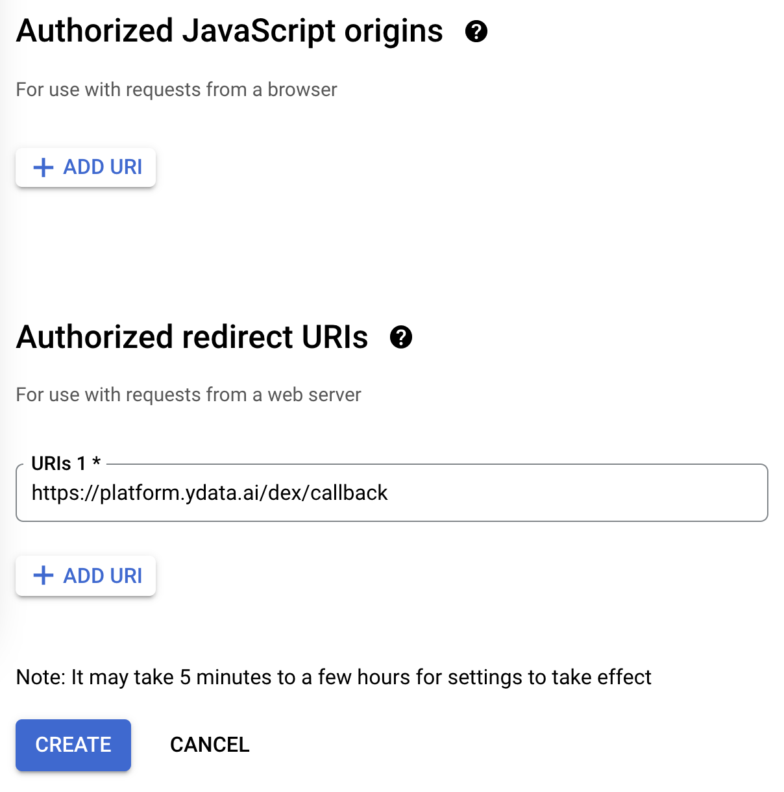

# Login Providers

**YData Fabric** offers a flexible and secure authentication system, allowing users to log in using a
variety of trusted identity providers. This technical documentation provides a comprehensive guide to
configuring and managing login providers for **YData Fabric**, including Google, Microsoft, and Amazon Cognito.
By leveraging these providers, users can benefit from seamless and secure access to **YData Fabric**, ensuring a smooth and efficient user experience.

## Google
1. Open the ^^[Google Cloud Console](https://console.cloud.google.com/)^^.
2. At the top-left, click **Menu**>**APIs & Services**>**Credentials**.
3. Click **Create Credentials**>**OAuth client ID**.
4. Click **Application type**>**Web application**.
5. In the "Name" field, type a name for the credential. This name is only shown in the Cloud Console.
6. Leave the “**Authorized JavaScript origins”** empty**.**
    Add a new “**Authorized redirect URIs**” with the platform endpoint with a suffix `*/dex/callback*`
    For the provided example:

    === "If you are using the **DNS Public Endpoint**"

        {: style="width:40%"}

    === "Or, if you are using the **DNS  Custom Domain**"

        {: style="width:40%"}

7. Click “Create”
8. Save the following credentials:
    - a. Client ID

        The Client ID for the Web Application
    - b. Client Secret

        The Client Secret for the Web Application
    - c. APP Hosted domain

        `Google supports whitelisting allowed domains when using G Suite`
        For example, for one company with the emails like person@example.com, the APP Hosted domain is example.com

9. Use the credentials as inputs for **YData Fabric**.

You can find more details in ^^[Google's official documentation](https://developers.google.com/workspace/guides/create-credentials#oauth-client-id)^^.

## Microsoft
1. Open the ^^[Azure Portal](https://portal.azure.com/)^^
2. Go to “Entra ID”
3. Click “App registrations”
4. Click “New registration”
5. Choose a name
6. For the supported account types, choose the most appropriated choice for you.
7. For the Redirect URI, choose “Web”, and fill with the platform endpoint with a suffix `*/dex/callback*`.
For the provided example:

    === "If you are using the **DNS Public Endpoint**"

        {: style="width:40%"}

    === "Or, if you are using the **DNS  Custom Domain**"

        {: style="width:40%"}

8. Click “Register”
9. Go to “Certificates & Secrets”, generate a new secret and save the value **(not the secret id)**. Please choose a large expiration date. This value cannot be changed after the installation of the platform.
10. Go to “Overview” and save the following credentials:
    - a. Client ID

        The Application (client) ID

    - b. Client Secret

        The secret generated in step 9 **(not the secret id)**.

    - c. Tenant ID

        The Directory (tenant) ID

11. Use the credentials as inputs for **YData Fabric**.

### Consent workflow
The admin consent workflow is necessary to configure, so you can access the platform using the app registered above.

1. Open the ^^[Azure Portal](https://portal.azure.com/)^^
2. Go to “Azure Active Directory”
3. Click "Enterprise applications”
4. Open the “Consent and permissions” page → “User consent settings”
5. Check with the AD administrator if an administrator is required to login to the app, or if all users can consent for the apps.

(missing image here)
