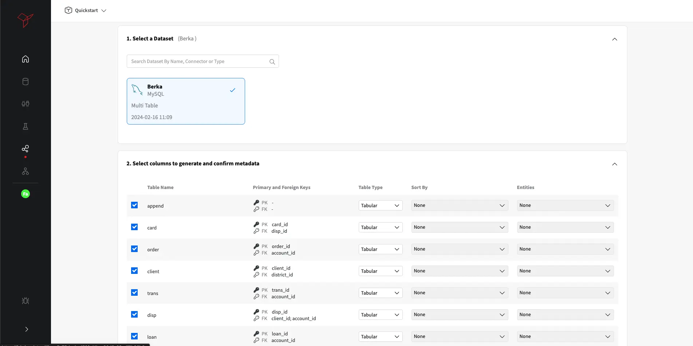
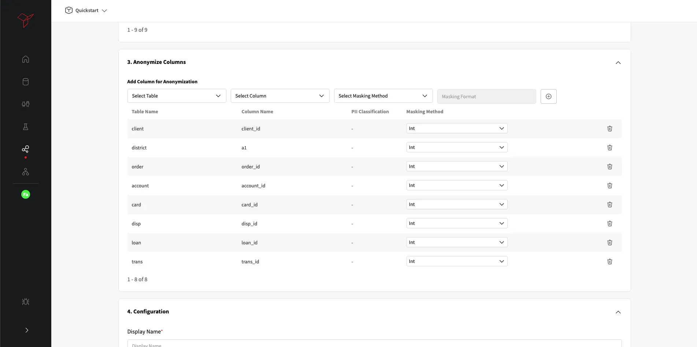
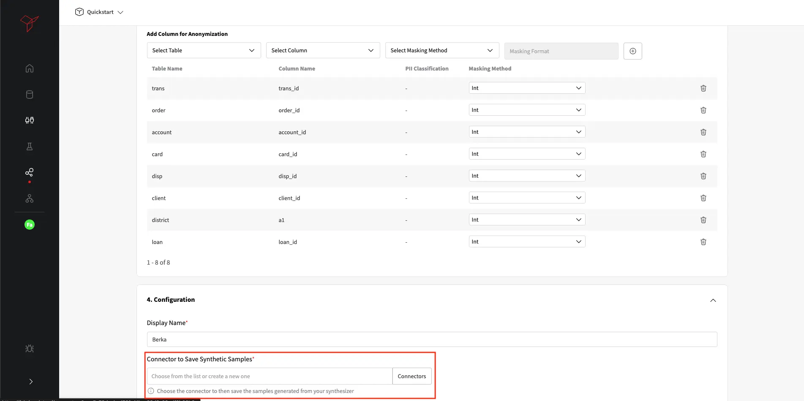
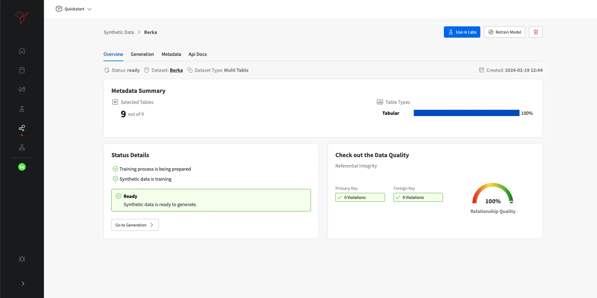

# How to create your first Relational Database Synthetic Data generator

:fontawesome-brands-youtube:{ .youtube }
Check this quickstart video on <a href="https://youtu.be/40Q56xZbv00?si=T6DMZ-f8mAyPdzf7"><u>how to create your first Relational Database Synthetic Data generator</u></a>.

To generate your first synthetic relational database, you need to have a Multi-Dataset already available in your Data Catalog.
Check this tutorial to see how you can <a href="../create_multitable_dataset"><u>add your first dataset to Fabric’s Data Catalog</u></a>.

With your database created as a Datasource, you are now able to start configure your Synthetic Data (SD) generator to create a replicate of your database.
You can either select **"Synthetic Data"** from your left side menu, or you can select **"Create Synthetic Data"** in your project Home
as shown in the image below.

{: style="width:75%"}

You'll be asked to select the dataset you wish to generate synthetic data from and verify the tables you'd like to
include in the synthesis process, validating their data types - *Time-series* or *Tabular*.

!!! Tip "Table data types are relevant for synthetic data quality"
    In case some of your tables hold time-series information (meaning there is a time relation between records) it is very important
    that during the process of configuring your synthetic data generator you do change update your tables data types accordingly.
    This will not only ensure the quality of that particular table, but also the overall database quality and relations.

{: style="width:75%"}

All the PK and FK identified based on the database schema definition, have an automatically created anonymization setting defined.
Aa standard and incremental integer will be used as the anonymization configuration, but user can change to other pre-defined generation options
or regex base (user can provide the expected pattern of generation).

{: style="width:75%"}

Finally, as the last step of our process it comes the **Synthetic Data** generator specific configurations, for this particular case we need to
define both *Display Name* and the *Destination connector*. The *Destination connector* it is mandatory and allow to select the database where
the generated synthetic database is expected to be written.
After providing both inputs we can finish the process by clicking in the **"Save"** button as per the image below.

{: style="width:75%"}

Your **Synthetic Data** generator is now training and listed under **"Synthetic Data"**. While the model is being trained, the *Status* will be
🟡, as soon as the training is completed successfully it will transition to 🟢.
Once the Synthetic Data generator has finished training, you're ready to start generating your first synthetic dataset.
You can start by exploring an overview of the model configurations and even validate the quality of the synthetic data generator from a referential integrity
point of view.

{: style="width:75%"}

Next, you can generate synthetic data samples by accessing the *Generation* tab or click on *"Go to Generation"*.
In this section, you are able to generate as many synthetic samples as you want.
For that you need to define the size of your database in comparison to the real one. This ratio is provided as a percentage.
In the example below, we have asked a sample with 100% size, meaning, a synthetic database with the same size as the original.

{: style="width:75%"}

A new line in your *"Sample History"* will be shown and as soon as the sample generation is completed you will be able to
check the quality the synthetic data already available in your destination database.

**Congrats!** 🚀 You have now successfully created your first Relation **Synthetic Database** with Fabric.
Get ready for your journey of improved quality data for AI.
