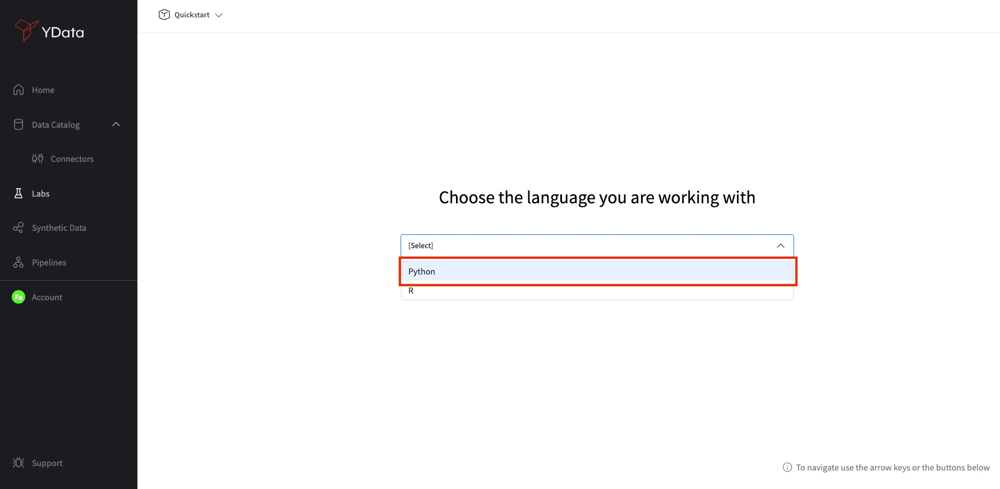
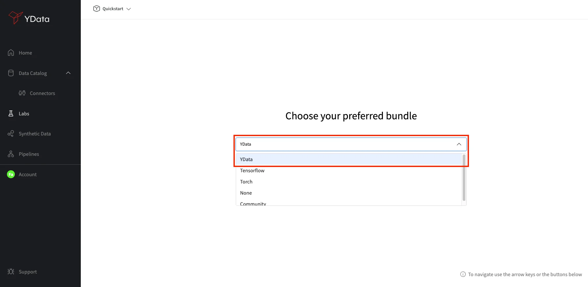
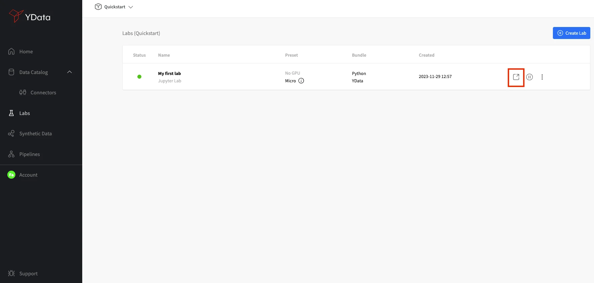
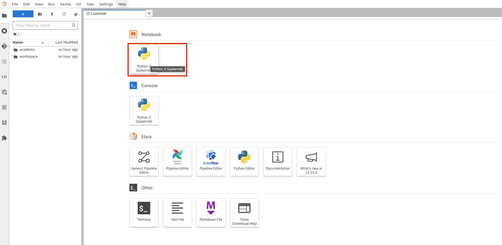

# How to create your first Lab environment

Labs are code environments for a more flexible development of data-driven solutions while leveraging Fabric capabilities
combined with already loved tools such as scikit-learn, numpy and pandas.
To create your first **Lab**, you can use the **“Create Lab”** from Fabric’s home, or you can access it from the Labs
module by selecting it on the left side menu, and clicking the **“Create Lab”** button.

{: style="width:75%"}

Next, a menu with different IDEs will be shown. As a quickstart select *Jupyter Lab*. As labs are development environments
you will be also asked what language you would prefer your environment to support: *R* or *Python*. Select Python.

| Select IDE                                                                             | Select language                                                                           |
|----------------------------------------------------------------------------------------|-------------------------------------------------------------------------------------------|
| {: style="width:90%"} | {: style="width:90%"} |

Bundles are environments with pre-installed packages. Select YData bundle, so we can leverage some other Fabric features
such as Data Profiling, Synthetic Data and Pipelines.

{: style="width:75%"}

As a last step, you will be asked to configure the infrastructure resources for this new environment as well as giving it
a *Display Name*. We will keep the defaults,
but you have flexibility to select GPU acceleration or whether you need more computational resources for your developments.

{: style="width:75%"}

Finally, your Lab will be created and added to the "Labs" list, as per the image below. The status of the lab will be
🟡 while preparing, and this process takes a few minutes, as the infrastructure is being allocated to your development environment.
As soon as the status changes to 🟢, you can open your lab by clicking in the button as shown below:

{: style="width:75%"}

Create a new notebook in the JupyterLab and give it a name. You are now ready to start your developments!

| Create a new notebook                                                                  | Notebook created                                                                               |
|----------------------------------------------------------------------------------------|------------------------------------------------------------------------------------------------|
| {: style="width:90%"} | {: style="width:90%"} |

**Congrats!** 🚀 You have now successfully created your first **Lab** a code environment, so you can benefit from the most
advanced Fabric features as well as compose complex data workflows.
Get ready for your journey of improved quality data for AI.
