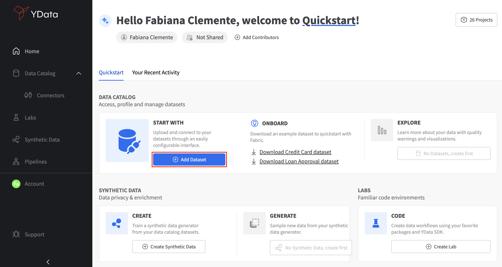
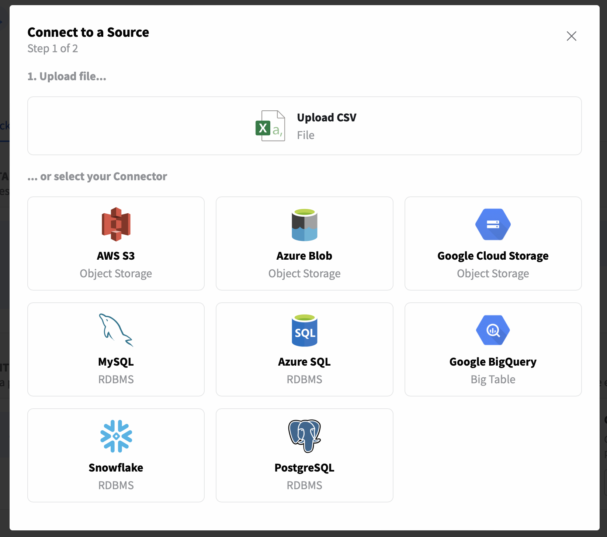
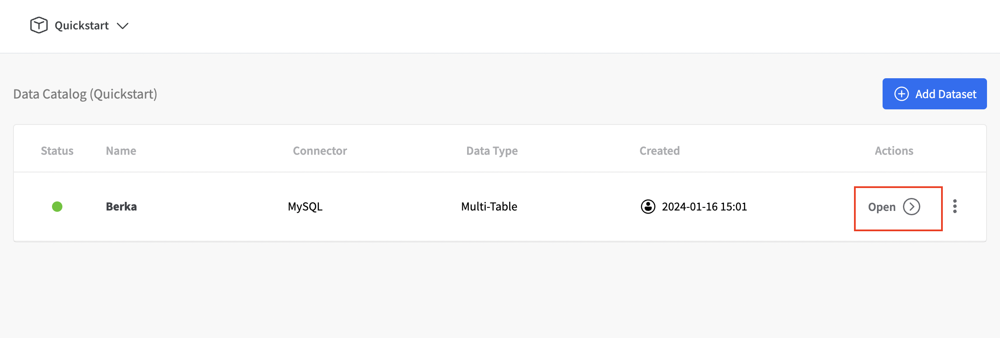
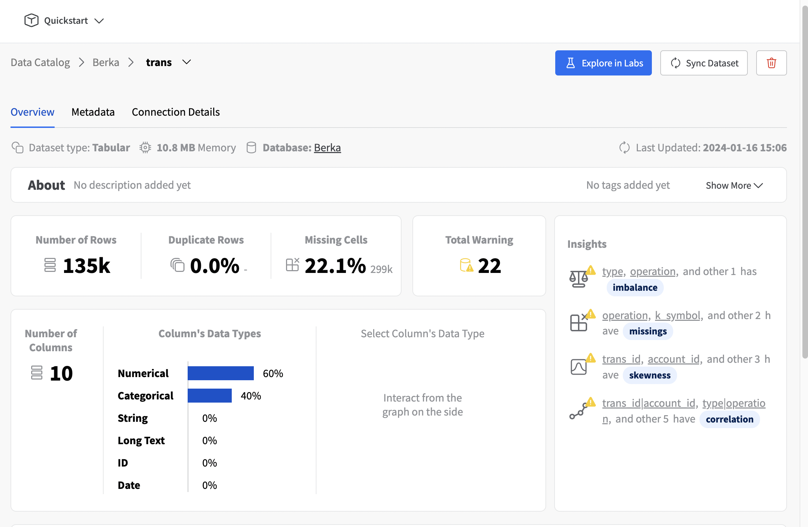

# How to create your first Relational database in Fabric's Catalog

To create your first multi-table dataset in the **Data Catalog**, you can start by clicking on **"Add Dataset"** from the Home section.
Or click to **Data Catalog** (on the left side menu) and click **“Add Dataset”**.

{: style="width:75%"}

After that the below modal will be shown. You will need to select a connector. To create a multi-table dataset, we need to choose an RDBMS connector like Azure SQL, Snowflake or MySQL.
In this case let's select MySQL.

{: style="width:40%"}

Once you've selected the **“MySQL”** connector, a new screen will appear, enabling you to introduce the connection details such as database username, host, password as well as the database name.

{: style="width:60%"}

With the *Connector* created, you'll be able to add a dataset and specify its properties:

- **Name:** The name of your dataset;
- **Table:** You can create a dataset with all the tables from the schema or select the tables that you need in your project.
- **Query:** Create a single table dataset by providing a query

{: style="width:45%"}

Now both the Connector to the MySQL Berka database and Berka dataset will be added to our Catalog.
As soon as the status is green, you can navigate your Dataset. Click in **Open** dataset as per the image below.

{: style="width:75%"}

Within the **Dataset** details, you can gain valuable insights like your database schema.

{: style="width:75%"}

For each an every table you can explore the both an overview on the structure (number of columns, number of rows, etc.) but also a useful
summary of the quality and warnings regarding your dataset behaviour.

{: style="width:75%"}

**Congrats!** 🚀 You have now successfully created your first **Connector** and **Multi-table Dataset** in Fabric’s Data Catalog.
To get the both the ID of your database and project you can decompose the URL from the Database schema overview page. The structure is as follows:

```
    https://fabric.ydata.ai/rdbms/{your-dataset-id}?ns={your-project-id}
```

Get ready for your journey of improved quality data for AI.
