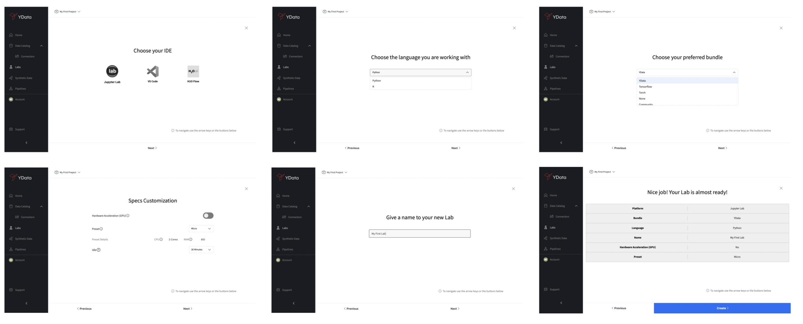
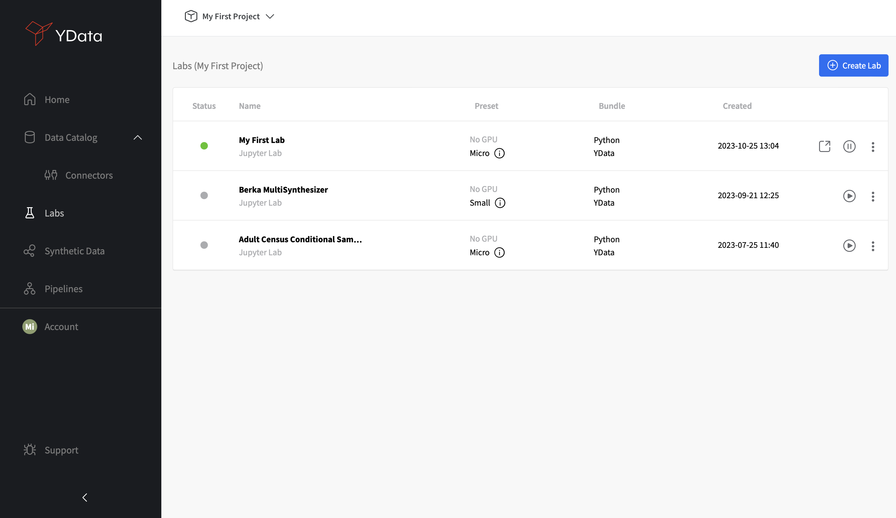
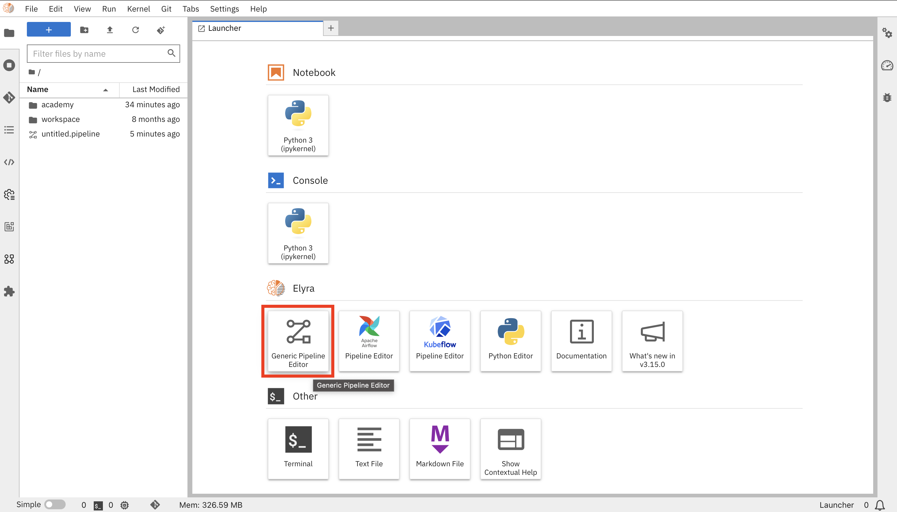

# How to create your first Pipeline

The best way to get started with Pipelines is to use the interactive Pipeline editor available in the Labs with Jupyter Lab set as IDE. From the **Home** section, start by accessing the **Labs** and clicking on **"Create Lab"**.

<figure markdown>
{: style="height:600px;width:1200px"}
</figure>

Choose Jupyter Lab as your IDE, the language you’re working with (Python or R), your preferred bundle (we suggest YData), set the additional configuration details, and give your Lab a name.

<figure markdown>
{: style="height:400px;width:1200px"}
</figure>

Your Lab will be created and added the **"Labs"** tab, where you'll be able to see all available Labs.

<figure markdown>
{: style="height:600px;width:1500px"}
</figure>

From here, you can use the **"Generic Pipeline Editor"** to start building your first Pipeline.

<figure markdown>
{: style="height:600px;width:1500px"}
</figure>

Once you're in the Pipeline editor, you can add blocks by dragging and dropping notebooks, Python scripts, or R scripts, and connect them to define the desired execution sequence. Each block's parameters can be individually configured by right-clicking on the block and select the **"Open Properties"** menu. You'll be able to leverage input files for credentials, environment variables for workflow settings, software runtime specification, and per-block hardware needs:

<iframe width="800" height="400" src="https://www.youtube.com/embed/_zZBt2nWiH8" title="Data profiling in a single click" frameborder="0" allow="accelerometer; autoplay; clipboard-write; encrypted-media; gyroscope; picture-in-picture; web-share" allowfullscreen></iframe>

The built Pipeline can be directly ran from the editor and it will then be automatically available in the **Pipelines** section of the UI, where it can be viewed and managed.

<figure markdown>
{: style="height:600px;width:1300px"}
</figure>
