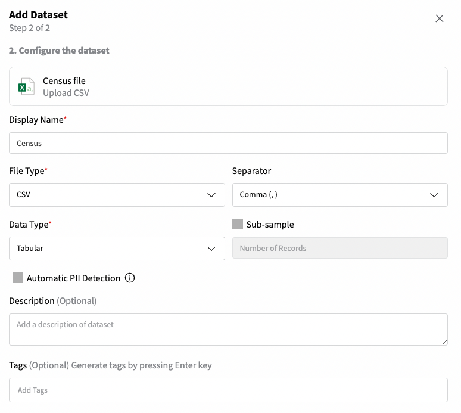

# How to create your first Dataset from a CSV file

:fontawesome-brands-youtube:{ .youtube }
Check this quickstart video on <a href="https://youtu.be/1zYreRKsNGE"><u>how to create your first Dataset from a CSV file</u></a>.

To create your first dataset in the **Data Catalog**, you can start by clicking on **"Add Dataset"** from the Home section.
Or click to **Data Catalog** (on the left side menu) and click **“Add Dataset”**.

{: style="width:75%"}

After that the below modal will be shown. You will need to select a connector. To upload a CSV file, we need to select **“Upload CSV”**.

{: style="width:40%"}

Once you've selected the **“Upload CSV”** connector, a new screen will appear, enabling you to upload your file and designate a name for your connector.
This file upload connector will subsequently empower you to create one or more datasets from the same file at a later stage.

| Loading area                                                                               | Upload csv file                                                                            |
|--------------------------------------------------------------------------------------------|--------------------------------------------------------------------------------------------|
| {: style="width:90%"} | {: style="width:90%"} |

With the *Connector* created, you'll be able to add a dataset and specify its properties:

- **Name:** The name of your dataset;
- **Separator:** This is an important parameter to make sure that we can parse your CSV correctly. The default value is “,”.
- **Data Type:** Whether your dataset contains tabular or time-series (i.e., containing temporal dependency) data.

{: style="width:45%"}

Your created Connector *(“Census File”)* and Dataset *(“Census”)* will be added to the Data Catalog.
As soon as the status is green, you can navigate your Dataset. Click in **Open Dataset** as per the image below.

{: style="width:75%"}

Within the **Dataset** details, you can gain valuable insights through our automated data quality profiling.
This includes comprehensive metadata and an overview of your data, encompassing details like row count, identification
of duplicates, and insights into the overall quality of your dataset.

{: style="width:75%"}

Or perhaps, you want to further explore through visualization, the profile of your data with both univariate
and multivariate of your data.

{: style="width:75%"}

**Congrats!** 🚀 You have now successfully created your first **Connector** and **Dataset** in Fabric’s Data Catalog.
Get ready for your journey of improved quality data for AI.
