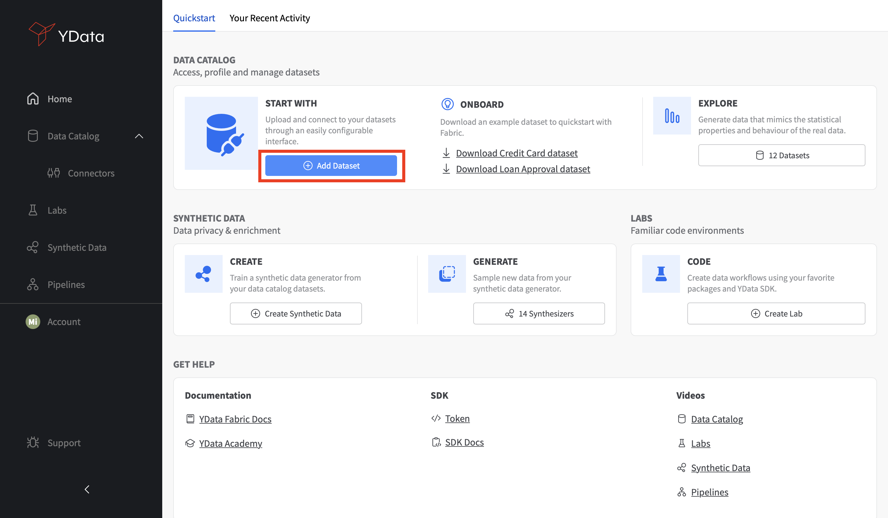
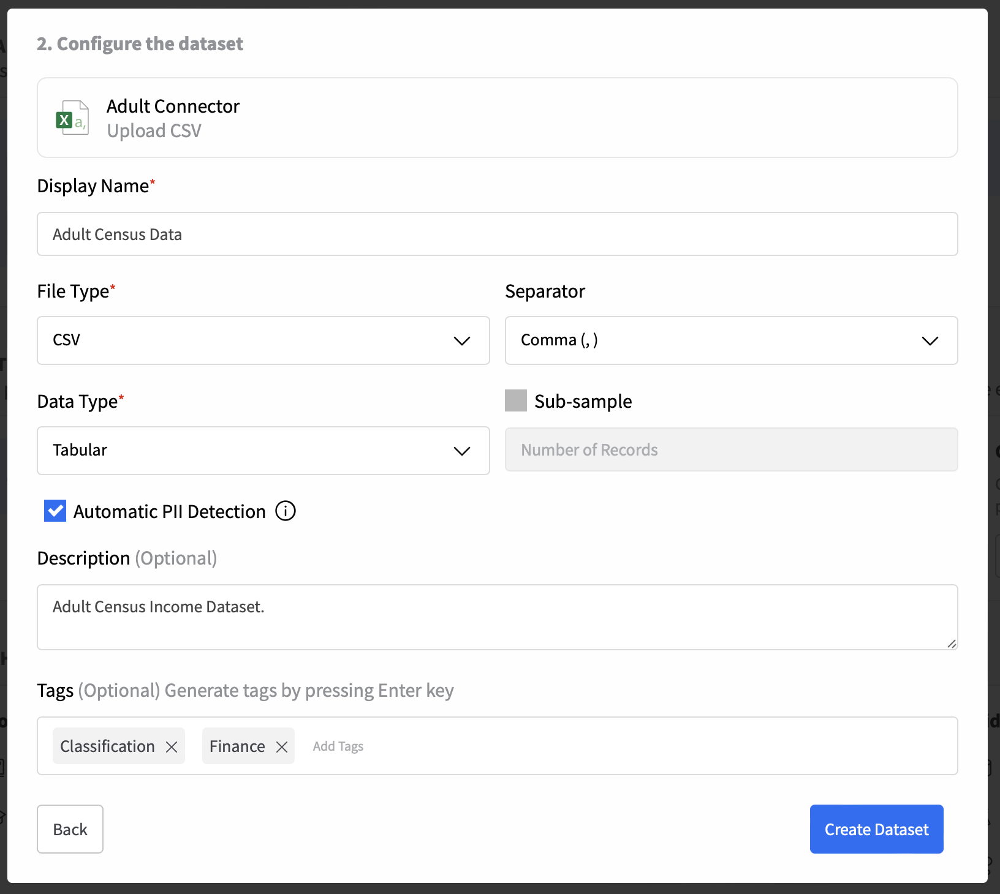

# Quickstart

## How to load your first dataset?
To load your first dataset into the Data Catalog, you can start by clicking on **"Add Dataset"** from the **Home** section. 

<figure markdown>
{: style="height:550px;width:1000px"}
</figure>   

Since each dataset is associated with a Connector, you'll need to create one by clicking on **"Create Connector"**. 

<figure markdown>
{: style="height:500px;width:550px"}
</figure>

After choosing the desired connector, you'll need to providing the necessary details. The information required depends on the type of connector.

<figure markdown>
{: style="height:500px;width:1500px"}
</figure>

After the Connector is configured, you'll be able to add a dataset and specify its properties such as *name*, and *file* and *data types*. You can also enable the **automatic detection of potential Personal Identifiable Information (PII)** and give your dataset an insightful *description* and general *tags* that you'd like to associate with the data.

<figure markdown>
{: style="height:700px;width:900px"}
</figure>

Your recently created Connector and Dataset will be added to the Data Catalog, where you can see all your available connectors and datasets.

<figure markdown>
{: style="height:550px;width:1000px"}
</figure>